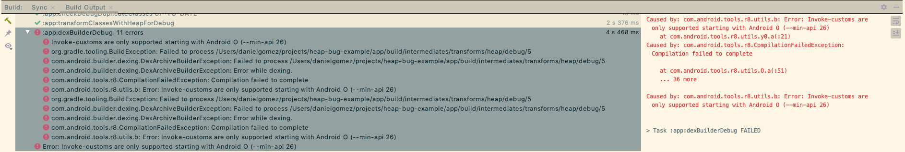

# Example on Error from Heap.io

Output from Android Studio:



Error:

```
Caused by: com.android.builder.dexing.DexArchiveBuilderException: Failed to process /Users/danielgomez/projects/heap-bug-example/app/build/intermediates/transforms/heap/debug/5

:app:dexBuilderDebug
Invoke-customs are only supported starting with Android O (--min-api 26)
org.gradle.tooling.BuildException: Failed to process /Users/danielgomez/projects/heap-bug-example/app/build/intermediates/transforms/heap/debug/5
com.android.builder.dexing.DexArchiveBuilderException: Failed to process /Users/danielgomez/projects/heap-bug-example/app/build/intermediates/transforms/heap/debug/5
com.android.builder.dexing.DexArchiveBuilderException: Error while dexing.
com.android.tools.r8.CompilationFailedException: Compilation failed to complete
com.android.tools.r8.utils.b: Error: Invoke-customs are only supported starting with Android O (--min-api 26)
org.gradle.tooling.BuildException: Failed to process /Users/danielgomez/projects/heap-bug-example/app/build/intermediates/transforms/heap/debug/5
com.android.builder.dexing.DexArchiveBuilderException: Failed to process /Users/danielgomez/projects/heap-bug-example/app/build/intermediates/transforms/heap/debug/5
com.android.builder.dexing.DexArchiveBuilderException: Error while dexing.
com.android.tools.r8.CompilationFailedException: Compilation failed to complete
com.android.tools.r8.utils.b: Error: Invoke-customs are only supported starting with Android O (--min-api 26)
Error: Invoke-customs are only supported starting with Android O (--min-api 26)

```